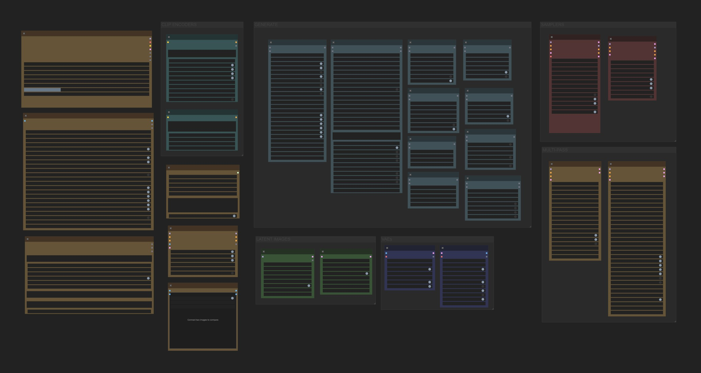

# ComfyUI Easy-Illustrious

A comprehensive node suite for ComfyUI optimized for Illustrious XL models, featuring advanced prompt construction, intelligent sampling, scene generation, and color correction tools.

[](LICENSE)
[](https://github.com/comfyanonymous/ComfyUI)
[](https://civitai.com/models)
[](https://github.com/regiellis/ComfyUI-EasyIllustrious)
[](https://github.com/ltdrdata/ComfyUI-Manager)

## Features

- **Illustrious-optimized workflows**: Defaults, presets, and parameters tuned specifically for Illustrious XL models
- **Comprehensive character/artist database**: Real-time search across 5k+ characters and artists from Danbooru/E621
- **Advanced sampling nodes**: Multi-pass and triple-pass samplers with intelligent parameter management
- **Smart prompt construction**: Chainable prompt nodes with automatic formatting and optimization
- **Unified color pipeline**: Integrated color correction with live preview and smart caching
- **Complete node ecosystem**: CLIP encoders, latent manipulation, VAE operations, attention coupling, and more

> [!Note]:
> This suite is designed primarily for Illustrious XL models. Other SDXL-based models are supported but may require parameter adjustments.

> [!Tip]
> Easiest install: Use ComfyUI Manager. Open Manager, search for "EasyIllustrious", click Install, then restart ComfyUI.



## Architecture

### Core Components

**Prompt/Content Generation**
- Base Model (IllustriousMasterModel)
- Prompt Builder (IllustriousPrompt) 
- Character/Artist Selectors (IllustriousCharacters, IllustriousArtists)
- E621 Character/Artist Variants
- Style Components (Hairstyles, Clothing, Poses)
- Pony Token Compatibility Layer

**Sampling/Scheduling**
- KSampler Pro with Illustrious optimizations
- Preset-based KSampler for rapid prototyping
- Multi-Pass and Triple-Pass sampling architectures
- Custom scheduler with content-aware noise patterns

**Encoding/Latent Operations**
- Illustrious-tuned CLIP text encoders (positive/negative)
- Empty latent generation with model-aware sizing
- Latent upscaling with intelligent interpolation
- VAE encode/decode with tiling support

**Utilities/Post-processing**
- Unified Color Suite with real-time preview
- TIPO prompt optimizer with restructuring algorithms
- Smart Scene Generator with template system
- Attention Coupling for multi-concept conditioning
- Auto Outpaint with soft-mask blending

### UI Enhancements

The suite includes JavaScript-based UI improvements loaded from `web/js/`:

- Bottom panel help integration
- Inline parameter tooltips and validation
- Real-time search suggestions with fuzzy matching
- Context menu extensions for quick actions
- Node-specific optimization shortcuts

## Installation

### Via ComfyUI Manager (recommended)

1. Open ComfyUI Manager (Extensions/Manager in the ComfyUI UI)
2. In the search box, type: EasyIllustrious
3. Click Install, wait for completion
4. Restart ComfyUI to load the nodes

Notes

- If you don't see it immediately, click Refresh/Reload in Manager and try again.
- Updates are delivered via Manager; use the Update button when available.

### Manual Installation

```bash
cd ComfyUI/custom_nodes
git clone https://github.com/regiellis/ComfyUI-EasyIllustrious
pip install -r ComfyUI-EasyIllustrious/requirements.txt
# Restart ComfyUI
```

### Dependencies

Required Python packages:
- `inquirer` - Interactive CLI components
- `tqdm` - Progress bar utilities
- `colorama` - Terminal color output
- `psutil` - System resource monitoring

## Configuration

### Recommended Settings for Illustrious XL

**Sampling Parameters**
- CFG Scale: 4.0-6.5 (optimal: 5.0)
- Steps: 24-28 for standard resolution, 30+ for high-resolution
- Sampler: euler_ancestral (balanced) or DPM++ 2M Karras (smooth)
- Scheduler: normal (standard), karras (1536px+)

**Resolution Guidelines**
- Training resolution: 1024x1024
- Portrait: 832x1216 
- Landscape: 1216x832
- Widescreen: 1344x768

### Memory Optimization

The suite includes automatic memory management:
- Dynamic batch size adjustment based on VRAM
- Intelligent model loading with fallback options  
- Smart caching with LRU eviction policies
- Tiled VAE operations for large images

## Node Reference

### Prompt Construction Nodes

| Class | Display Name | Function |
|-------|--------------|----------|
| IllustriousMasterModel | Base Model | Model loader with Illustrious-specific optimizations |
| IllustriousPrompt | Prompt | Main prompt builder with chain support and formatting |
| IllustriousCharacters | Characters | Character selector with weighted mixing (up to 5) |
| IllustriousArtists | Artists | Artist style selector with weighted blending |
| IllustriousE621Characters | E621 Characters | E621 character database integration |
| IllustriousE621Artists | E621 Artists | E621 artist database integration |
| IllustriousHairstyles | Hairstyles | Curated hairstyle database with smart placement |
| IllustriousClothing | Clothing | Clothing/outfit selector with style consistency |
| IllustriousPoses | Poses | Pose reference integration with OpenPose compatibility |
| IllustriousPonyTokens | Pony Tokens | Pony Diffusion token compatibility layer |

### Sampling/Generation Nodes

| Class | Display Name | Function |
|-------|--------------|----------|
| IllustriousKSamplerPro | KSampler Pro | Enhanced KSampler with live preview and optimization |
| IllustriousKSamplerPresets | KSampler Presets | Preset-based sampler for rapid iteration |
| IllustriousMultiPassSampler | Multi-Pass Sampler | Two-stage sampling (structure + detail) |
| IllustriousTriplePassSampler | Triple-Pass Sampler | Three-stage sampling architecture |
| IllustriousScheduler | Custom Scheduler | Advanced noise scheduling with content awareness |

### Encoding/Latent Nodes

| Class | Display Name | Function |
|-------|--------------|----------|
| IllustriousCLIPTextEncoder | CLIP Text Encoder | Positive prompt encoding with Illustrious optimizations |
| IllustriousNegativeCLIPEncoder | CLIP Negative Encoder | Negative prompt encoding with quality presets |
| IllustriousEmptyLatentImage | Empty Latent | Latent generation with model-aware sizing |
| IllustriousLatentUpscale | Latent Upscale | Latent space upscaling with multiple interpolation modes |
| IllustriousVAEEncode | VAE Encode | Image to latent conversion with tiling support |
| IllustriousVAEDecode | VAE Decode | Latent to image conversion with tiling support |

### Utility Nodes

| Class | Display Name | Function |
|-------|--------------|----------|
| IllustriousColorSuite | Color Suite | Unified color correction with live preview |
| TIPOPromptOptimizer | TIPO Optimizer | Prompt restructuring and optimization |
| IllustriousScenesPlus | Scenes Plus | Smart scene generation with template system |
| IllustriousAttentionCouple | Attention Couple | Multi-concept attention coupling |
| IllustriousAutoOutpaint | Auto Outpaint | Automated outpainting with soft-mask blending |

## API Reference

### Search System

The suite exposes a built-in search API for character/artist lookup:

```python
# Character search endpoint
GET /illustrious/search/characters?q={query}&limit={n}

# Artist search endpoint  
GET /illustrious/search/artists?q={query}&limit={n}
```

Response format:
```json
{
    "results": [
        {
            "name": "character_name",
            "category": "series_name", 
            "popularity": 95.2,
            "aliases": ["alt_name_1", "alt_name_2"]
        }
    ],
    "total": 1247,
    "query_time": 0.003
}
```

### Cache Management

Smart caching system with programmatic control:

```python
# Cache operations
cache.clear()                    # Clear all cached data
cache.clear_type('prompts')      # Clear specific cache type
cache.set_limit('2048MB')        # Set memory limit
cache.get_stats()                # Get usage statistics
```

## Example Workflows

See `example_workflows/` for complete workflow files:

- **Basic.json** - Fundamental text-to-image workflow
- **Multi Pass.json** - Advanced multi-stage sampling
- **Color Corrector.json** - Post-processing with color correction
- **Custom Scheduler.json** - Advanced scheduling techniques
- **Node Gallery.json** - Comprehensive node showcase

### Basic Text-to-Image
```
Empty Latent → Characters → Artists → KSampler Pro → VAE Decode
```

### Advanced Scene Generation
```
Scene Generator → Prompt Builder → Multi-Pass Sampler → Color Suite → VAE Decode
```

### Style Transfer Pipeline
```
VAE Encode → Artists → KSampler Pro (low denoise) → VAE Decode
```

## Troubleshooting

### Common Issues

**Oversaturation/Overcooked Images**
- Reduce CFG scale to 4.0-4.5
- Switch to karras scheduler at high resolutions
- Enable Dynamic Thresholding in advanced settings

**Soft/Foggy Images**
- Increase CFG scale to 5.5-6.5
- Add more sampling steps (28-35)
- Verify model is Illustrious XL compatible

**Search Functionality Issues**
- Ensure query length ≥ 2 characters
- Use underscore format: "character_name"
- Check network connectivity for database updates

**Memory Issues**
- Enable Smart Cache with appropriate limits
- Use tiled VAE for large images
- Reduce batch sizes for high-resolution generation

### Performance Optimization

- Use `--gpu-only` flag for VRAM-constrained systems
- Enable `--preview-method latent2rgb` for faster previews
- Set `--vram-usage-level normal` for balanced performance

## Development

### Contributing

1. Fork the repository
2. Create a feature branch
3. Implement changes with appropriate tests
4. Submit pull request with detailed description

### Code Style

- Follow PEP 8 conventions
- Use type hints for all function signatures  
- Document all public APIs with docstrings
- Maintain backward compatibility for existing workflows

### Testing

```bash
# Run unit tests
python -m pytest tests/

# Run integration tests
python -m pytest tests/integration/

# Run performance benchmarks
python -m pytest tests/performance/ --benchmark
```

## Documentation

Comprehensive documentation is available in the `web/docs/` directory:

- Node-specific guides with technical specifications
- API reference documentation
- Workflow examples and best practices
- Performance tuning guidelines

Each node includes embedded help accessible via the ComfyUI interface.

## License

MIT License - see [LICENSE](LICENSE) for details.

## References

- [Illustrious XL Model Documentation](https://civitai.com/models/373803)
- [ComfyUI Custom Nodes Development Guide](https://github.com/comfyanonymous/ComfyUI)
- [SDXL Architecture Specifications](https://arxiv.org/abs/2307.01952)

---

For bug reports and feature requests, please use the [GitHub Issues](https://github.com/regiellis/ComfyUI-EasyIllustrious/issues) system.